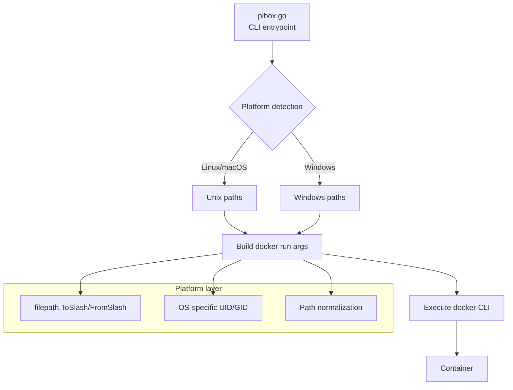

# Портируемый CLI для PIBOX

## 🎯 Краткий ответ

**Да, лучший выбор — Go.** Один статический бинарник (`pibox.exe` / `pibox`) для Linux/macOS/Windows без зависимостей на рантайм. Docker CLI сам написан на Go — вы получите родную экосистему и кросс-платформенность из коробки.

---

## 📋 Сравнение вариантов

| Критерий | **Go** ⭐ | Rust | Python | Node.js |
|----------|---------|------|--------|---------|
| **Один бинарник** | ✅ Статический ~15 МБ | ✅ ~10 МБ | ❌ Нужен Python | ❌ Нужен Node |
| **Кросс-компиляция** | ✅ `GOOS=windows go build` | ✅ cross-rs | ❌ | ❌ |
| **Скорость разработки CLI** | ✅ Флаги/команды в stdlib | ⚠️ Больше boilerplate | ✅ argparse | ✅ commander.js |
| **Subprocess (docker)** | ✅ `os/exec` — нативно | ✅ std::process | ⚠️ subprocess | ✅ child_process |
| **Портируемость путей** | ✅ `filepath` решает всё | ⚠️ Ручная обработка | ⚠️ os.path | ⚠️ path |
| **Порог входа** | Средний | Высокий | Низкий | Низкий |
| **Сообщество/Docker** | ✅ Родная экосистема | Среднее | Хорошее | Хорошее |

**Почему не Python/Node:** требуют установку рантайма на хост — противоречит философии «установил и работаем».

**Почему не Rust:** отличный результат, но дольше разработка и сложнее поддержка для этой задачи.

---

## 🏗️ Архитектура Go-решения



### Структура проекта

```
pibox/
├── cmd/
│   └── pibox/
│       └── main.go              # Входная точка
├── internal/
│   ├── cli/
│   │   ├── root.go              # Корневая команда
│   │   ├── run.go               # pibox run
│   │   ├── build.go             # pibox build
│   │   ├── env.go               # pibox env list/create/remove
│   │   ├── shell.go             # pibox shell
│   │   └── doctor.go            # pibox doctor
│   ├── docker/
│   │   ├── client.go            # Проверка docker, версия
│   │   └── run.go               # Сборка docker run команды
│   ├── paths/
│   │   ├── pibox.go             # PIBOX_DIR, автодетект
│   │   └── isolation.go         # Проверка вложенности workspace
│   └── models/
│       └── models.go            # Копирование models.json
├── go.mod
├── go.sum
├── Makefile                      # Кросс-компиляция
└── install.sh                    # Упрощённый установщик
```

---

## 🔧 Ключевые компоненты

### 1. `cmd/pibox/main.go` — входная точка

```go
package main

import (
    "os"
    "pibox/internal/cli"
)

func main() {
    if err := cli.Execute(); err != nil {
        os.Exit(1)
    }
}
```

### 2. `internal/cli/root.go` — корневая команда

```go
package cli

import (
    "fmt"
    "os"
    "pibox/internal/paths"
    "github.com/spf13/cobra"
)

var (
    PiboxDir string
    Version  = "1.0.0"
)

var rootCmd = &cobra.Command{
    Use:   "pibox",
    Short: "Pi Coding Agent в изолированном Docker-контейнере",
}

func Execute() error {
    // Автодетект PIBOX_DIR
    PiboxDir = paths.GetPiboxDir()
    return rootCmd.Execute()
}
```

### 3. `internal/paths/pibox.go` — платформонезависимые пути

```go
package paths

import (
    "os"
    "path/filepath"
    "runtime"
)

// GetPiboxDir определяет каталог установки PIBOX
func GetPiboxDir() string {
    // 1. Из переменной окружения
    if dir := os.Getenv("PIBOX_DIR"); dir != "" {
        return filepath.Clean(dir)
    }
    
    // 2. Относительно исполняемого файла
    exe, err := os.Executable()
    if err != nil {
        fallback, _ := os.UserHomeDir()
        return filepath.Join(fallback, "pibox")
    }
    
    // Бинарник в PIBOX_DIR/bin/pibox → родитель PIBOX_DIR
    return filepath.Dir(filepath.Dir(exe))
}

// WorkspaceInPibox проверяет, что workspace не пересекается с PIBOX_DIR
func WorkspaceInPibox(workspace, piboxDir string) (bool, error) {
    ws, err := filepath.Abs(workspace)
    if err != nil {
        return false, err
    }
    
    pd, err := filepath.Abs(piboxDir)
    if err != nil {
        return false, err
    }
    
    // Проверяем вложенность в обе стороны
    if ws == pd || isSubpath(ws, pd) || isSubpath(pd, ws) {
        return true, nil
    }
    return false, nil
}

func isSubpath(parent, child string) bool {
    rel, err := filepath.Rel(parent, child)
    if err != nil {
        return false
    }
    return rel != ".." && !filepath.IsAbs(rel)
}
```

### 4. `internal/docker/run.go` — сборка команды

```go
package docker

import (
    "fmt"
    "os"
    "os/exec"
    "path/filepath"
    "runtime"
    "strconv"
)

type RunConfig struct {
    EnvName     string
    Workspace   string
    PiboxDir    string
    Image       string
    Publish     []string
    PassEnv     []string
    MemoryLimit string
    CPULimit    string
    PidsLimit   int
    GitSafe     bool
    ResyncSkel  bool
    DryRun      bool
    Command     []string
}

// GetHostUIDGID возвращает UID/GID для маппинга
func GetHostUIDGID() (int, int) {
    if runtime.GOOS == "windows" {
        // На Windows Docker Desktop с WSL2 использует 1000
        // или из переменных окружения
        if uid := os.Getenv("HOST_UID"); uid != "" {
            if gid := os.Getenv("HOST_GID"); gid != "" {
                u, _ := strconv.Atoi(uid)
                g, _ := strconv.Atoi(gid)
                return u, g
            }
        }
        return 1000, 1000
    }
    
    // Linux/macOS: реальные UID/GID
    return os.Getuid(), os.Getgid()
}

// BuildRunArgs собирает аргументы для docker run
func BuildRunArgs(cfg RunConfig) []string {
    uid, gid := GetHostUIDGID()
    
    args := []string{
        "run", "--rm",
        "--name", fmt.Sprintf("pibox-%s-%d", cfg.EnvName, os.Getpid()),
        "--add-host", "host.docker.internal:host-gateway",
        "--cap-add", "SYS_PTRACE",
        "--cap-add", "NET_RAW",
        "--memory", cfg.MemoryLimit,
        "--cpus", cfg.CPULimit,
        "--pids-limit", strconv.Itoa(cfg.PidsLimit),
        "-e", fmt.Sprintf("HOST_UID=%d", uid),
        "-e", fmt.Sprintf("HOST_GID=%d", gid),
    }
    
    // Монтирования — Go filepath автоматически конвертирует
    envPath := filepath.Join(cfg.PiboxDir, "env", cfg.EnvName)
    args = append(args,
        "-v", envPath+":/home/pi",
        "-v", cfg.Workspace+":/home/pi/workspace",
    )
    
    // Дополнительные опции
    if cfg.GitSafe {
        args = append(args, "-e", "PIBOX_GIT_SAFE=1")
    }
    if cfg.ResyncSkel {
        args = append(args, "-e", "PIBOX_RESYNC_SKEL=1")
    }
    for _, p := range cfg.Publish {
        args = append(args, "-p", p)
    }
    for _, e := range cfg.PassEnv {
        args = append(args, "-e", e)
    }
    
    // Интерактивность
    if isTerminal() {
        args = append(args, "-it")
    } else {
        args = append(args, "-i")
    }
    
    // Образ и команда
    args = append(args, cfg.Image)
    if len(cfg.Command) > 0 {
        args = append(args, cfg.Command...)
    }
    
    return args
}

// isTerminal проверяет, подключен ли TTY
func isTerminal() bool {
    // Простая проверка через файловые дескрипторы
    fi, err := os.Stdout.Stat()
    if err != nil {
        return false
    }
    return (fi.Mode() & os.ModeCharDevice) != 0
}

// Execute запускает docker с собранными аргументами
func Execute(cfg RunConfig) error {
    args := BuildRunArgs(cfg)
    
    if cfg.DryRun {
        fmt.Printf("DRY RUN: docker %v\n", args)
        return nil
    }
    
    cmd := exec.Command("docker", args...)
    cmd.Stdin = os.Stdin
    cmd.Stdout = os.Stdout
    cmd.Stderr = os.Stderr
    
    return cmd.Run()
}
```

### 5. `internal/cli/run.go` — команда run

```go
package cli

import (
    "fmt"
    "os"
    "pibox/internal/docker"
    "pibox/internal/paths"
    "github.com/spf13/cobra"
)

var runCmd = &cobra.Command{
    Use:   "run [OPTIONS] [--] [PI_ARGS...]",
    Short: "Запуск агента в контейнере",
    RunE:  runAgent,
}

var (
    envName     string
    publish     []string
    passEnv     []string
    memoryLimit string
    cpuLimit    string
    pidsLimit   int
    gitSafe     bool
    resyncSkel  bool
    dryRun      bool
)

func init() {
    runCmd.Flags().StringVarP(&envName, "env", "e", "default", "Окружение")
    runCmd.Flags().StringArrayVarP(&publish, "publish", "p", nil, "Проброс порта")
    runCmd.Flags().StringArrayVarP(&passEnv, "pass-env", "E", nil, "Проброс переменной")
    runCmd.Flags().StringVar(&memoryLimit, "memory", "4g", "Лимит памяти")
    runCmd.Flags().StringVar(&cpuLimit, "cpus", "2", "Лимит CPU")
    runCmd.Flags().IntVar(&pidsLimit, "pids-limit", 512, "Лимит процессов")
    runCmd.Flags().BoolVar(&gitSafe, "git-safe", false, "Git safe.directory")
    runCmd.Flags().BoolVar(&resyncSkel, "resync-skel", false, "Повторный merge skel")
    runCmd.Flags().BoolVar(&dryRun, "dry-run", false, "Только показать команду")
    
    rootCmd.AddCommand(runCmd)
}

func runAgent(cmd *cobra.Command, args []string) error {
    // Разделение аргументов после --
    piArgs := extractArgsAfterDashDash(args)
    
    // Текущий каталог = workspace
    workspace, err := os.Getwd()
    if err != nil {
        return fmt.Errorf("не могу определить текущий каталог: %w", err)
    }
    
    // Проверка изоляции
    overlap, err := paths.WorkspaceInPibox(workspace, PiboxDir)
    if err != nil {
        return err
    }
    if overlap {
        return fmt.Errorf("workspace (%s) пересекается с PIBOX_DIR (%s)", workspace, PiboxDir)
    }
    
    // Автосоздание окружения
    envPath := fmt.Sprintf("%s/env/%s", PiboxDir, envName)
    if _, err := os.Stat(envPath); os.IsNotExist(err) {
        fmt.Printf("==> Создаю окружение '%s' из шаблона\n", envName)
        if err := createEnvironment(envPath); err != nil {
            return err
        }
    }
    
    // Копирование models.json
    if err := copyModelsJSON(envPath); err != nil {
        return err
    }
    
    // Запуск
    cfg := docker.RunConfig{
        EnvName:     envName,
        Workspace:   workspace,
        PiboxDir:    PiboxDir,
        Image:       "pibox:latest",
        Publish:     publish,
        PassEnv:     passEnv,
        MemoryLimit: memoryLimit,
        CPULimit:    cpuLimit,
        PidsLimit:   pidsLimit,
        GitSafe:     gitSafe,
        ResyncSkel:  resyncSkel,
        DryRun:      dryRun,
        Command:     piArgs,
    }
    
    return docker.Execute(cfg)
}

func extractArgsAfterDashDash(args []string) []string {
    for i, arg := range args {
        if arg == "--" {
            return args[i+1:]
        }
    }
    return nil
}
```

### 6. `Makefile` — кросс-компиляция

```makefile
BINARY_NAME=pibox
VERSION=1.0.0
BUILD_TIME=$(shell date -u +%Y-%m-%dT%H:%M:%SZ)
LDFLAGS=-X main.Version=$(VERSION) -s -w

.PHONY: build build-all clean test

build:
	go build -ldflags "$(LDFLAGS)" -o $(BINARY_NAME) ./cmd/pibox

build-all:
	# Linux
	GOOS=linux GOARCH=amd64 go build -ldflags "$(LDFLAGS)" -o dist/$(BINARY_NAME)-linux-amd64 ./cmd/pibox
	GOOS=linux GOARCH=arm64 go build -ldflags "$(LDFLAGS)" -o dist/$(BINARY_NAME)-linux-arm64 ./cmd/pibox
	
	# macOS
	GOOS=darwin GOARCH=amd64 go build -ldflags "$(LDFLAGS)" -o dist/$(BINARY_NAME)-darwin-amd64 ./cmd/pibox
	GOOS=darwin GOARCH=arm64 go build -ldflags "$(LDFLAGS)" -o dist/$(BINARY_NAME)-darwin-arm64 ./cmd/pibox
	
	# Windows
	GOOS=windows GOARCH=amd64 go build -ldflags "$(LDFLAGS)" -o dist/$(BINARY_NAME)-windows-amd64.exe ./cmd/pibox
	GOOS=windows GOARCH=arm64 go build -ldflags "$(LDFLAGS)" -o dist/$(BINARY_NAME)-windows-arm64.exe ./cmd/pibox

test:
	go test ./...

clean:
	rm -rf dist $(BINARY_NAME)
```

---

## 📦 Интеграция с существующим проектом

### Минимальные изменения

| Файл | Статус | Действие |
|------|--------|----------|
| `run.sh` | → Заменяется | На Go-бинарник `pibox` |
| `install.sh` | → Упрощается | Устанавливает бинарник + создаёт структуру |
| `entrypoint.sh` | ✅ Остаётся | Работает внутри контейнера (Linux) |
| `Dockerfile` | ✅ Без изменений | Build-контекст тот же |
| `env-template/` | ✅ Без изменений | Каталоги/файлы |
| `models.json` | ✅ Без изменений | Конфиг |

### Новый `install.sh` (упрощённый)

```bash
#!/usr/bin/env bash
set -euo pipefail

VERSION="1.0.0"
PLATFORM=$(uname -s)
ARCH=$(uname -m)

# Определение имени бинарника
case "${PLATFORM}-${ARCH}" in
    Linux-x86_64)  BINARY="pibox-linux-amd64" ;;
    Linux-aarch64) BINARY="pibox-linux-arm64" ;;
    Darwin-x86_64) BINARY="pibox-darwin-amd64" ;;
    Darwin-arm64)  BINARY="pibox-darwin-arm64" ;;
    *) die "Неподдерживаемая платформа: ${PLATFORM}-${ARCH}" ;;
esac

# Для Windows: отдельный установщик (install.bat или PowerShell)
if [ "$PLATFORM" = "MINGW64_NT" ] || [ "$PLATFORM" = "MSYS_NT" ]; then
    BINARY="pibox-windows-amd64.exe"
fi

PIBOX_DIR="${PIBOX_DIR:-$HOME/pibox}"
mkdir -p "$PIBOX_DIR/bin"

# Скачивание бинарника (или сборка из исходников)
if command -v go >/dev/null 2>&1; then
    echo "==> Сборка из исходников..."
    cd "$(dirname "$0")/pibox-go"
    go build -o "$PIBOX_DIR/bin/pibox" ./cmd/pibox
else
    echo "==> Скачивание бинарника..."
    URL="https://github.com/YOUR-USER/pibox/releases/download/v${VERSION}/${BINARY}"
    curl -fsSL "$URL" -o "$PIBOX_DIR/bin/pibox"
    chmod +x "$PIBOX_DIR/bin/pibox"
fi

# Копирование ресурсов (env-template, Dockerfile, etc.)
cp -r env-template "$PIBOX_DIR/"
cp Dockerfile entrypoint.sh .dockerignore "$PIBOX_DIR/docker/"
mkdir -p "$PIBOX_DIR/env/default"
cp -r env-template/. "$PIBOX_DIR/env/default/"
cp models.json "$PIBOX_DIR/env/"

echo "==> Установка завершена: $PIBOX_DIR/bin/pibox"
```

### `install.ps1` для Windows

```powershell
# install.ps1 — установщик для Windows
$ErrorActionPreference = "Stop"

$VERSION = "1.0.0"
$PIBOX_DIR = if ($env:PIBOX_DIR) { $env:PIBOX_DIR } else { "$env:USERPROFILE\pibox" }
$BINARY_URL = "https://github.com/YOUR-USER/pibox/releases/download/v$VERSION/pibox-windows-amd64.exe"

# Создание структуры
New-Item -ItemType Directory -Force -Path "$PIBOX_DIR\bin" | Out-Null
New-Item -ItemType Directory -Force -Path "$PIBOX_DIR\docker" | Out-Null
New-Item -ItemType Directory -Force -Path "$PIBOX_DIR\env" | Out-Null

# Скачивание бинарника
Write-Host "==> Скачивание pibox..." -ForegroundColor Cyan
Invoke-WebRequest -Uri $BINARY_URL -OutFile "$PIBOX_DIR\bin\pibox.exe"

# Копирование ресурсов
Copy-Item -Path "env-template" -Destination "$PIBOX_DIR" -Recurse -Force
Copy-Item -Path "Dockerfile", "entrypoint.sh", ".dockerignore" -Destination "$PIBOX_DIR\docker" -Force

# Создание default окружения
New-Item -ItemType Directory -Force -Path "$PIBOX_DIR\env\default" | Out-Null
Copy-Item -Path "env-template\*" -Destination "$PIBOX_DIR\env\default" -Recurse -Force
Copy-Item -Path "models.json" -Destination "$PIBOX_DIR\env\" -Force

# Добавление в PATH
$userPath = [Environment]::GetEnvironmentVariable("Path", "User")
if ($userPath -notlike "*$PIBOX_DIR\bin*") {
    [Environment]::SetEnvironmentVariable("Path", "$userPath;$PIBOX_DIR\bin", "User")
    Write-Host "==> Добавлено в PATH. Перезапустите терминал." -ForegroundColor Yellow
}

Write-Host "==> Установка завершена: $PIBOX_DIR\bin\pibox.exe" -ForegroundColor Green
```

---

## 🎯 Результат

**Единый бинарник `pibox` (или `pibox.exe` на Windows):**

```bash
# Linux/macOS:
pibox --version
pibox build
pibox -e php8
pibox --dry-run

# Windows (PowerShell):
pibox.exe --version
pibox.exe build
pibox.exe -e php8
pibox.exe --dry-run
```

**Преимущества:**

| Аспект | Bash | Go |
|--------|------|-----|
| Windows | ❌ WSL2/Git Bash | ✅ Нативно |
| macOS | ✅ | ✅ |
| Linux | ✅ | ✅ |
| Установка | install.sh + PATH | Один файл в PATH |
| Зависимости | bash, docker | docker |
| Размер | ~0 | ~15 МБ |
| Скорость | Мс на запуск | Мс на запуск |
| Отладка | echo + set -x | delve, debug prints |

**Рекомендация:** начните с Go для CLI (`run`), оставив bash для `entrypoint.sh` (внутри Linux-контейнера) и упростив `install.sh`. Это даст портируемость без переписывания внутренностей контейнера.