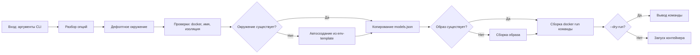

# Задача 6 — `run.sh` → CLI `pibox`

## 📋 Общая информация

| Параметр | Значение |
|---|---|
| **Контекст проекта** | PIBOX — Docker-песочница для Pi Coding Agent: `/home/pi` контейнера подменяется bind-mount'ом окружения с хоста, текущий каталог пользователя становится `workspace`. CLI `pibox` — единая точка входа, управляет окружениями, проверяет безопасность и собирает `docker run`. |
| **Цель задачи** | Реализовать полноценный CLI `pibox` с подкомандами (`run`, `build`, `env`, `shell`, `update`, `doctor`), опциями запуска, проверками безопасности (изоляция workspace от PIBOX_DIR) и поддержкой проброса портов/переменных окружения. |
| **Зависимости** | Задача 3 (образ `pibox:latest`), задача 5 (entrypoint.sh с контрактом env-переменных) |
| **Артефакты** | `run.sh` — полная реализация CLI, заменяющая заглушку из задачи 2 |
| **Не входит в задачу** | Установщик `install.sh` (задача 7), тесты (задача 8), документация (задача 9) |

---

## 🏗️ Ключевые архитектурные решения

| # | Решение | Обоснование |
|---|---|---|
| 1 | **`--dry-run` как обязательная опция** | Позволяет проверить собранную команду `docker run` без реального запуска; используется в тестах и отладке |
| 2 | **Проверка изоляции workspace через `realpath`** | Защищает от случайного редактирования конфигов самого `pibox` при запуске из `PIBOX_DIR` или его подкаталогов |
| 3 | **Автосоздание окружения из `env-template`** | Если окружение не существует, оно создаётся автоматически; `models.json` копируется при первом запуске |
| 4 | **Проброс портов/переменных через массивы bash** | Безопасная сборка аргументов `docker run` без word splitting; поддержка повторяемых опций |
| 5 | **`--add-host host.docker.internal:host-gateway`** | Обеспечивает доступ к сервисам на хосте (например, локальному API) из контейнера |
| 6 | **`--cap-add=SYS_PTRACE` и `--cap-add=NET_RAW`** | Необходимы для работы `strace`, `gdb`, `tcpdump` и сетевых утилит внутри контейнера |

---

## 1. Контракт с задачей 5 (entrypoint.sh)

CLI передаёт в контейнер следующие переменные окружения:

| Переменная | Значение | Назначение |
|---|---|---|
| `HOST_UID` | `$(id -u)` | UID хост-пользователя для динамической подстройки |
| `HOST_GID` | `$(id -g)` | GID хост-пользователя для динамической подстройки |
| `PIBOX_GIT_SAFE` | `0`/`1` | Включить git safe.directory для workspace |
| `PIBOX_RESYNC_SKEL` | `0`/`1` | Принудительный повторный skel-merge |

---

## 2. `run.sh` — полная реализация CLI

```bash
#!/usr/bin/env bash
# ============================================================================
# PIBOX — CLI для безопасного запуска Pi Coding Agent в Docker.
#
# Подкоманды:
#   run (дефолт)   запуск агента в контейнере
#   build          сборка Docker-образа
#   env            управление окружениями (list, create, remove)
#   shell          отладочная оболочка в контейнере
#   update         обновление установки
#   doctor         диагностика окружения
#
# Опции запуска:
#   -e, --env NAME         окружение (по умолчанию default)
#   -p, --publish SPEC     проброс порта (повторяемая)
#   -E, --pass-env VAR     проброс переменной окружения (повторяемая)
#       --env-file FILE    файл с переменными окружения
#       --memory LIMIT     лимит памяти (напр. 4g)
#       --cpus N           лимит CPU
#       --pids-limit N     лимит процессов
#       --resync-skel      повторный merge /opt/skel в home
#       --git-safe         git safe.directory для workspace
#       --dry-run          напечатать команду docker run и выйти
#       --name NAME        имя контейнера
#   -h, --help             эта справка
#   -V, --version          версия
#
# Контракт с entrypoint.sh (задача 5):
#   Передаёт HOST_UID, HOST_GID, PIBOX_GIT_SAFE, PIBOX_RESYNC_SKEL через -e
# ============================================================================

set -euo pipefail

# --- Константы ----------------------------------------------------------------

VERSION="0.1.0"
DEFAULT_ENV="default"
IMAGE_NAME="pibox:latest"

# Определяем PIBOX_DIR относительно расположения скрипта
# (для установленной версии в PIBOX_DIR/bin, для исходников — в корне репо)
PIBOX_DIR="${PIBOX_DIR:-$(cd "$(dirname "${BASH_SOURCE[0]}")/.." && pwd)}"

# --- Хелперы -------------------------------------------------------------------

err()  { echo "pibox: error: $*" >&2; }
warn() { echo "pibox: warn:  $*" >&2; }
log()  { echo "==> pibox: $*" >&2; }
die()  { err "$*"; exit 1; }

version() {
    echo "pibox ${VERSION}"
}

usage() {
    cat <<'EOF'
pibox — запуск Pi Coding Agent в изолированном Docker-контейнере

Использование:
    pibox [run] [OPTIONS] [--] [PI_ARGS...]

Подкоманды:
    run                        запуск агента (по умолчанию)
    build [--no-cache]         сборка Docker-образа
    env list|create|remove     управление окружениями
    shell [-e NAME]            отладочная оболочка в контейнере
    update                     обновление установки
    doctor                     диагностика окружения

Опции запуска:
    -e, --env NAME             окружение (по умолчанию default)
    -p, --publish SPEC         проброс порта (повторяемая)
    -E, --pass-env VAR         проброс переменной окружения (повторяемая)
        --env-file FILE        файл с переменными окружения
        --memory LIMIT         лимит памяти (напр. 4g)
        --cpus N               лимит CPU
        --pids-limit N         лимит процессов
        --resync-skel          повторный merge /opt/skel в home
        --git-safe             git safe.directory для workspace
        --dry-run              напечатать команду docker run и выйти
        --name NAME            имя контейнера
    -h, --help                 эта справка
    -V, --version              версия

Примеры:
    pibox                      # запуск в default окружении
    pibox -e php8              # запуск в окружении php8
    pibox -p 8080:80           # проброс порта 8080 на 80
    pibox -- pi -p "test"      # передача аргументов pi
    pibox shell -e php8        # оболочка в окружении php8

EOF
}

# --- Проверки -------------------------------------------------------------------

# Проверка, что docker установлен и работает
check_docker() {
    if ! command -v docker >/dev/null 2>&1; then
        die "docker не найден. Установите Docker >= 20.10: https://docs.docker.com/engine/install/"
    fi

    if ! docker info >/dev/null 2>&1; then
        die "Docker daemon не отвечает. Проверьте статус: systemctl status docker"
    fi
}

# Проверка имени окружения
validate_env_name() {
    local env_name="$1"
    if [[ ! "$env_name" =~ ^[A-Za-z0-9][A-Za-z0-9._-]*$ ]]; then
        die "Недопустимое имя окружения: '$env_name'. Разрешены буквы, цифры, точки, дефисы и подчёркивания."
    fi
}

# Проверка, что workspace не совпадает с PIBOX_DIR и не вложен в него
check_workspace_isolation() {
    local ws="$(pwd)"
    local ws_real
    local pibox_real

    # Получаем абсолютные пути без symlink'ов
    ws_real="$(realpath "$ws")"
    pibox_real="$(realpath "$PIBOX_DIR")"

    # Проверяем вложенность
    if [[ "$ws_real" == "$pibox_real" || "$ws_real" == "$pibox_real"/* ]]; then
        die "Workspace ($ws) находится внутри PIBOX_DIR ($PIBOX_DIR). Это запрещено."
    fi

    if [[ "$pibox_real" == "$ws_real"/* ]]; then
        die "PIBOX_DIR ($PIBOX_DIR) находится внутри workspace ($ws). Это запрещено."
    fi
}

# --- Управление окружениями -----------------------------------------------------

# Создание окружения из env-template, если оно не существует
create_env() {
    local env_name="$1"
    local env_dir="$PIBOX_DIR/env/$env_name"

    if [[ ! -d "$env_dir" ]]; then
        log "Создаю окружение '$env_name' из шаблона..."
        mkdir -p "$env_dir"
        cp -a "$PIBOX_DIR/env-template/." "$env_dir/"
    fi
}

# Копирование models.json в окружение при первом запуске
copy_models_json() {
    local env_name="$1"
    local env_dir="$PIBOX_DIR/env/$env_name"
    local models_src="$PIBOX_DIR/env/models.json"
    local models_dst="$env_dir/.pi/agent/models.json"

    # Копируем только если источник существует и назначение отсутствует
    if [[ -f "$models_src" && ! -f "$models_dst" ]]; then
        mkdir -p "$(dirname "$models_dst")"
        cp "$models_src" "$models_dst"
        log "Скопирован models.json в окружение '$env_name'"
    fi
}

# Список доступных окружений
list_envs() {
    echo "Доступные окружения:"
    local env_dir
    for env_dir in "$PIBOX_DIR/env"/*; do
        [[ -d "$env_dir" ]] || continue
        echo "  $(basename "$env_dir")"
    done
}

# --- Сборка команды docker run --------------------------------------------------

# Собирает массив аргументов для docker run
build_docker_run_cmd() {
    local -a cmd=(
        "docker" "run" "--rm"
        "--name" "${CONTAINER_NAME:-pibox-${ENV_NAME}-${RANDOM}}"
        "--add-host" "host.docker.internal:host-gateway"
        "--cap-add" "SYS_PTRACE"
        "--cap-add" "NET_RAW"
    )

    # Опции ресурсов (с дефолтами)
    cmd+=("--memory" "${MEMORY:-4g}")
    cmd+=("--cpus" "${CPUS:-2}")
    cmd+=("--pids-limit" "${PIDS_LIMIT:-512}")

    # Переменные окружения для entrypoint.sh (задача 5)
    cmd+=("-e" "HOST_UID=$(id -u)")
    cmd+=("-e" "HOST_GID=$(id -g)")
    cmd+=("-e" "PIBOX_GIT_SAFE=${GIT_SAFE:-0}")
    cmd+=("-e" "PIBOX_RESYNC_SKEL=${RESYNC_SKEL:-0}")

    # Монтирования
    cmd+=("-v" "$PIBOX_DIR/env/$ENV_NAME:/home/pi")
    cmd+=("-v" "$(pwd):/home/pi/workspace")

    # Проброс портов
    for opt in "${PUBLISH_OPTS[@]}"; do
        cmd+=("-p" "$opt")
    done

    # Проброс переменных окружения
    for opt in "${PASS_ENV_OPTS[@]}"; do
        cmd+=("-e" "$opt")
    done

    # Файл переменных окружения
    if [[ -n "${ENV_FILE:-}" ]]; then
        cmd+=("--env-file" "$ENV_FILE")
    fi

    # Интерактивность (только если TTY)
    if [[ -t 0 && -t 1 ]]; then
        cmd+=("-it")
    else
        cmd+=("-i")
    fi

    # Образ и команда
    cmd+=("$IMAGE_NAME")

    # Аргументы pi (после --)
    cmd+=("${PI_ARGS[@]}")

    # Возвращаем команду в виде строки (для dry-run)
    echo "${cmd[@]}"
}

# --- Подкоманды -----------------------------------------------------------------

# Основная команда: запуск pi в контейнере
cmd_run() {
    local -a PI_ARGS=()
    local -a PUBLISH_OPTS=()
    local -a PASS_ENV_OPTS=()

    # Разбор аргументов для run
    while [[ $# -gt 0 ]]; do
        case "$1" in
            --)
                shift
                PI_ARGS=("$@")
                break
                ;;
            -e|--env)
                ENV_NAME="$2"
                shift 2
                ;;
            -p|--publish)
                PUBLISH_OPTS+=("$2")
                shift 2
                ;;
            -E|--pass-env)
                PASS_ENV_OPTS+=("$2")
                shift 2
                ;;
            --env-file)
                ENV_FILE="$2"
                shift 2
                ;;
            --memory)
                MEMORY="$2"
                shift 2
                ;;
            --cpus)
                CPUS="$2"
                shift 2
                ;;
            --pids-limit)
                PIDS_LIMIT="$2"
                shift 2
                ;;
            --resync-skel)
                RESYNC_SKEL=1
                shift
                ;;
            --git-safe)
                GIT_SAFE=1
                shift
                ;;
            --dry-run)
                DRY_RUN=1
                shift
                ;;
            --name)
                CONTAINER_NAME="$2"
                shift 2
                ;;
            *)
                err "Неизвестная опция или аргумент для run: $1"
                usage
                exit 1
                ;;
        esac
    done

    # Дефолтное окружение
    ENV_NAME="${ENV_NAME:-$DEFAULT_ENV}"

    # Проверки
    check_docker
    validate_env_name "$ENV_NAME"
    check_workspace_isolation

    # Автосоздание окружения
    create_env "$ENV_NAME"
    copy_models_json "$ENV_NAME"

    # Проверка образа
    if ! docker image inspect "$IMAGE_NAME" >/dev/null 2>&1; then
        warn "Образ $IMAGE_NAME не найден. Собираю..."
        cmd_build
    fi

    # Сборка команды
    local run_cmd
    run_cmd=$(build_docker_run_cmd)

    # Вывод или запуск
    if [[ "${DRY_RUN:-0}" == "1" ]]; then
        echo "DRY RUN: ${run_cmd}"
    else
        log "Запуск pi в окружении '$ENV_NAME'..."
        eval "$run_cmd"
    fi
}

# Сборка Docker-образа
cmd_build() {
    local no_cache=""

    # Разбор аргументов
    while [[ $# -gt 0 ]]; do
        case "$1" in
            --no-cache)
                no_cache="--no-cache"
                shift
                ;;
            *)
                err "Неизвестная опция для build: $1"
                usage
                exit 1
                ;;
        esac
    done

    check_docker

    log "Собираю образ $IMAGE_NAME..."
    docker build $no_cache -t "$IMAGE_NAME" "$PIBOX_DIR/docker"
}

# Управление окружениями
cmd_env() {
    local subcmd="${1:-list}"
    shift || true

    case "$subcmd" in
        list)
            list_envs
            ;;
        create)
            if [[ $# -lt 1 ]]; then
                die "env create требует имя окружения"
            fi
            local env_name="$1"
            validate_env_name "$env_name"
            create_env "$env_name"
            copy_models_json "$env_name"
            log "Окружение '$env_name' создано"
            ;;
        remove)
            if [[ $# -lt 1 ]]; then
                die "env remove требует имя окружения"
            fi
            local env_name="$1"
            if [[ "$env_name" == "default" ]]; then
                die "Нельзя удалить default окружение"
            fi
            local env_dir="$PIBOX_DIR/env/$env_name"
            if [[ -d "$env_dir" ]]; then
                rm -rf "$env_dir"
                log "Окружение '$env_name' удалено"
            else
                warn "Окружение '$env_name' не существует"
            fi
            ;;
        *)
            die "Неизвестная подкоманда env: $subcmd"
            ;;
    esac
}

# Отладочная оболочка в контейнере
cmd_shell() {
    local env_name="$DEFAULT_ENV"

    # Разбор аргументов
    while [[ $# -gt 0 ]]; do
        case "$1" in
            -e|--env)
                env_name="$2"
                shift 2
                ;;
            *)
                die "Неизвестная опция для shell: $1"
                ;;
        esac
    done

    validate_env_name "$env_name"
    create_env "$env_name"
    copy_models_json "$env_name"
    check_workspace_isolation

    check_docker

    log "Запуск оболочки в окружении '$env_name'..."
    docker run --rm -it \
        -e HOST_UID=$(id -u) -e HOST_GID=$(id -g) \
        -v "$PIBOX_DIR/env/$env_name:/home/pi" \
        -v "$(pwd):/home/pi/workspace" \
        "$IMAGE_NAME" bash
}

# Обновление установки (заглушка)
cmd_update() {
    log "Обновление pibox..."
    warn "Команда update ещё не реализована (см. задачу 7)"
}

# Диагностика окружения (заглушка)
cmd_doctor() {
    log "Диагностика pibox..."
    warn "Команда doctor ещё не реализована (см. задачу 8)"
}

# --- Основной блок --------------------------------------------------------------

main() {
    # Если первый аргумент не опция, то это подкоманда
    if [[ $# -gt 0 && "$1" != -* ]]; then
        SUBCOMMAND="$1"
        shift
    else
        SUBCOMMAND="run"
    fi

    # Вызов соответствующей подкоманды
    case "$SUBCOMMAND" in
        run)
            cmd_run "$@"
            ;;
        build)
            cmd_build "$@"
            ;;
        env)
            cmd_env "$@"
            ;;
        shell)
            cmd_shell "$@"
            ;;
        update)
            cmd_update "$@"
            ;;
        doctor)
            cmd_doctor "$@"
            ;;
        -h|--help)
            usage
            exit 0
            ;;
        -V|--version)
            version
            exit 0
            ;;
        *)
            err "Неизвестная подкоманда: $SUBCOMMAND"
            usage
            exit 1
            ;;
    esac
}

# Точка входа
main "$@"
```

---

## 3. Разбор ключевых функций

### 3.1 `check_workspace_isolation()` — безопасность

```bash
check_workspace_isolation() {
    local ws="$(pwd)"
    local ws_real
    local pibox_real

    # realpath разворачивает symlink'и и даёт абсолютный путь
    ws_real="$(realpath "$ws")"
    pibox_real="$(realpath "$PIBOX_DIR")"

    # Проверяем вложенность
    if [[ "$ws_real" == "$pibox_real" || "$ws_real" == "$pibox_real"/* ]]; then
        die "Workspace ($ws) находится внутри PIBOX_DIR ($PIBOX_DIR). Это запрещено."
    fi

    if [[ "$pibox_real" == "$ws_real"/* ]]; then
        die "PIBOX_DIR ($PIBOX_DIR) находится внутри workspace ($ws). Это запрещено."
    fi
}
```

**Зачем это нужно:** предотвращает случайное редактирование конфигов самого `pibox` агентом, если пользователь запустит `pibox` из каталога установки.

### 3.2 `build_docker_run_cmd()` — сборка команды

<details>
<summary>🔧 Как это работает</summary>

Функция собирает массив аргументов для `docker run`:

```bash
local -a cmd=(
    "docker" "run" "--rm"
    "--name" "${CONTAINER_NAME:-pibox-${ENV_NAME}-${RANDOM}}"
    "--add-host" "host.docker.internal:host-gateway"
    "--cap-add" "SYS_PTRACE"
    "--cap-add" "NET_RAW"
)
```

Затем добавляет:
- Лимиты ресурсов (`--memory`, `--cpus`, `--pids-limit`)
- Переменные окружения для entrypoint (`HOST_UID`, `HOST_GID`, `PIBOX_GIT_SAFE`, `PIBOX_RESYNC_SKEL`)
- Монтирования (`-v` для env и workspace)
- Проброс портов и переменных окружения
- Интерактивность (`-it` если TTY)
- Образ и команду pi

Возвращает команду в виде строки для `--dry-run` или выполнения через `eval`.

</details>

### 3.3 `cmd_run()` — основная логика запуска



---

## 4. Использование CLI

### 4.1 Основные сценарии

```bash
# 1. Запуск в default окружении
pibox

# 2. Запуск в конкретном окружении
pibox -e php8

# 3. Проброс порта
pibox -p 8080:80

# 4. Проброс переменной окружения
pibox -E OPENAI_API_KEY

# 5. Передача аргументов pi
pibox -- pi -p "Объясни этот код"

# 6. Отладочная оболочка
pibox shell

# 7. Просмотр команды без запуска
pibox --dry-run

# 8. Управление окружениями
pibox env list
pibox env create myenv
pibox env remove myenv
```

### 4.2 Опции запуска (полный список)

| Опция | Описание | Пример |
|---|---|---|
| `-e, --env NAME` | Окружение | `pibox -e php8` |
| `-p, --publish SPEC` | Проброс порта | `pibox -p 8080:80` |
| `-E, --pass-env VAR` | Проброс переменной | `pibox -E OPENAI_API_KEY` |
| `--env-file FILE` | Файл переменных | `pibox --env-file .env` |
| `--memory LIMIT` | Лимит памяти | `pibox --memory 4g` |
| `--cpus N` | Лимит CPU | `pibox --cpus 2` |
| `--pids-limit N` | Лимит процессов | `pibox --pids-limit 512` |
| `--resync-skel` | Повторный merge skel | `pibox --resync-skel` |
| `--git-safe` | Git safe.directory | `pibox --git-safe` |
| `--dry-run` | Вывод команды | `pibox --dry-run` |
| `--name NAME` | Имя контейнера | `pibox --name mypi` |

---

## 5. Верификация

```bash
# 1. Проверка help
./run.sh --help

# 2. Проверка version
./run.sh --version

# 3. Dry-run из пустого каталога
cd /tmp && /path/to/run.sh --dry-run

# Ожидание:
# DRY RUN: docker run --rm --name pibox-default-12345 --add-host host.docker.internal:host-gateway ...

# 4. Dry-run с опциями
cd /tmp && /path/to/run.sh -e test -p 8080:80 -E VAR1 --dry-run

# 5. Проверка изоляции (запуск из PIBOX_DIR должен дать ошибку)
cd $PIBOX_DIR && ./run.sh
# Ожидание: ошибка "Workspace находится внутри PIBOX_DIR"

# 6. Автосоздание окружения
cd /tmp && /path/to/run.sh -e newenv --dry-run
# Ожидание: env/newenv создан, models.json скопирован

# 7. Проверка проброса портов
cd /tmp && /path/to/run.sh -p 8080:80 --dry-run
# Ожидание: в команде есть -p 8080:80

# 8. Проверка проброса переменных
cd /tmp && /path/to/run.sh -E TEST_VAR --dry-run
# Ожидание: в команде есть -e TEST_VAR
```

---

## 6. ✅ Критерии готовности

- [ ] `./run.sh --help` выводит справку
- [ ] `./run.sh --version` выводит версию
- [ ] `./run.sh --dry-run` из любого каталога выводит корректную команду
- [ ] Запуск из `PIBOX_DIR` или его подкаталога блокируется с понятной ошибкой
- [ ] Автосоздание окружения из `env-template` работает
- [ ] `models.json` копируется в окружение при первом запуске
- [ ] Опции `-p`, `-E`, `--env-file`, `--memory`, `--cpus`, `--pids-limit` корректно собираются в команду
- [ ] `--dry-run` выводит команду без выполнения
- [ ] `pibox env list` показывает список окружений
- [ ] `pibox env create` создаёт новое окружение
- [ ] `pibox shell` запускает оболочку в контейнере
- [ ] `shellcheck run.sh` проходит без замечаний

---

## 7. ⚠️ Подводные камни

| # | Проблема | Решение |
|---|---|---|
| 1 | **Word splitting в пробросе портов** | Использование массивов bash для сборки аргументов |
| 2 | **Symlink'и в путях** | `realpath` для разворачивания symlink'ов при проверке изоляции |
| 3 | **Отсутствие Docker** | Явная проверка `command -v docker` и `docker info` |
| 4 | **Некорректное имя окружения** | Валидация через regex `^[A-Za-z0-9][A-Za-z0-9._-]*$` |
| 5 | **Образ не существует** | Автоматическая сборка через `cmd_build` с предупреждением |
| 6 | **Интерактивность без TTY** | Проверка `[ -t 0 ] && [ -t 1 ]` для добавления `-it` |
| 7 | **Дублирование опций** | Массивы для повторяемых опций (`-p`, `-E`) |

---

## 8. 🔗 Контракты, зафиксированные задачей 6

### Входные данные (CLI аргументы)

| Тип | Пример | Описание |
|---|---|---|
| Подкоманда | `run`, `build`, `env`, `shell` | Основная операция |
| Опция | `-e php8`, `-p 8080:80` | Настройки запуска |
| Разделитель | `--` | Отделяет опции pibox от аргументов pi |
| PI_ARGS | `pi -p "test"` | Аргументы для передачи pi |

### Выходные данные (docker run команда)

```bash
docker run --rm \
  --name pibox-default-12345 \
  --add-host host.docker.internal:host-gateway \
  --cap-add SYS_PTRACE \
  --cap-add NET_RAW \
  --memory 4g \
  --cpus 2 \
  --pids-limit 512 \
  -e HOST_UID=1000 \
  -e HOST_GID=1000 \
  -e PIBOX_GIT_SAFE=0 \
  -e PIBOX_RESYNC_SKEL=0 \
  -v /path/to/env/default:/home/pi \
  -v /path/to/workspace:/home/pi/workspace \
  -it \
  pibox:latest \
  pi
```

**Что получают следующие задачи:**

| Задача | Получает |
|---|---|
| **7 (install.sh)** | Готовый CLI для копирования в `PIBOX_DIR/bin/pibox` |
| **8 (тесты)** | CLI для тестирования через `--dry-run` и реальные запуски |